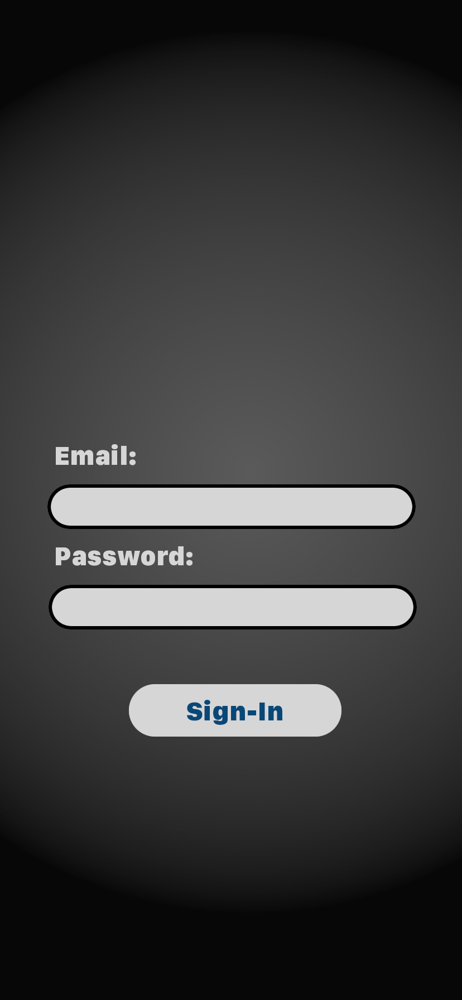

#  Foxhunt Mobile

## 1. Introduction

This document provide technical information about Foxhunt Mobile project. It is indended for all members of Foxhunt team. It describes goals of the project, main features and user stories, UI design, components, communication with backend and other.

Foxhunt Mobile - simulator ARDF. It allows to participate in competetions for seeking virtual transmitters.

[Amateur radio direction finding](https://en.wikipedia.org/wiki/Amateur_radio_direction_finding)

Parent project: 
[Foxhunt Code](https://gitlab.itechart-group.com/unitpl/foxhunt) | 
[Foxhunt documentation](https://foxhunt-simulator.atlassian.net/wiki/spaces/TEAM/pages)

## 2. Description

Mobile Foxhunt application helps users to participate in “fox hunt” game - similar to ARDF. Clients seeking for “transmitter” or “fox”. The game zone is shown on a map with marks for user position, start, finish and transmitter points. With knob controls user adjusts signal to follow. Also application gives user information about competitions and conditions on them, some help articles about how to play.

### 2.1. Product features

|Feature name | Description |
|--------------|-------------|
| User Registration | Sign-up and Sign-in functionality to store profile info, settings and for participation in competitions |
| Competitions List    | User can observe can obtain and observe list competitions currently underway  |
| Competition Details | User can review detailed information about competition - location, creator, limitations |
| Locations List | Review locations available for competitions |
| Map of location | Getting information about user position, start and finish points, located transmitters |
| Receiver | User can catch virtual signal from transmitter basing on orientation of device |
| Receiver adjustment | User able to adjust virtual frequency of the receiver and volume of sound |
| Trainer | Play alone virtually - to get acquainted with basic functionality
| Participation in competion | User has ability for play with other people synchonizing through internet | 
| Help | Help topics about the game, tips and tricks |

### 2.2. User roles

| Role | Description              |
|------|--------------------------|
| Unregistered User | Observes only basic information and can only registrate to the system |
| Registered User | Can review competitions and send request for participation in choosen one |
| Participant | User who subscribed to competition. Receive updates for competition, watching location information on map and make adjustments for the signal receiving. |

### 2.3. Environment

|||
|-------------------|-----------------|
| Hardware Platform: | iPhone and iPad |
| Operating System:  | iOS/iPadOS v13 or greater | 

### 2.4. Design

Application is splitted up on 4 views - as tabular pages:
1. **Current** - this view is used for current activity: observing information about participated competition, map with locations information and adjustment controls for catching signals from transmitters.
2. **Competitions** - view stores list of the competions currently registered in the system to which user has rights to read. User can get detailed info about by selecting item from the list.
3. **More** - Additional features of the application and settings of application.
4. **Help** - Help topics, tips and tricks.

Before opening main window of the application user starts with **sign-in** view till time they were authorized. 

#### 2.4.1 Current view.

#### 2.4.2 Competitions.

#### 2.4.3 More.

#### 2.4.4 Help.

#### 2.4.5 Login view.

### 2.5. Assumptions and dependencies

/// Product perspective: the description of the context and origin of the product prepared in a special form.

Product features: all the characteristics that will be implemented in the app in a short table view.

User roles and rights: the description of user classes in a brief table view.

Operating environment: hardware and software platforms, other products that need to be considered.

Design and Implementation Constraints: Anything that marginalizes the outside-the-box thinking of developers and designers.

User documents: A list of user-related documents that will be released along with the app.

Assumptions and Dependencies: Here you can place anything that is still not clear to classify in the current stage. ///

## 3. System features

/// Description and priority: detailed description and purpose.

Stimulus / Response Sequences: A trigger that initiates the feature.

Functional Requirements (Use Cases, User Stories): The user of a scenario interacts with the functionality from start to finish, including alternate scenarios and exceptions. ///

## 4. External interfaces

/// User interfaces: prototype and description of all app screens and view sections. Screens (tabs) must be presented separately, with images, presentations, and all other visual materials available.

Hardware interfaces: logical and physical characteristics of the interfaces between the app and the hardware. Device models, use of physical controls, communication protocols, and so on.

Software Interfaces: APIs, cross-platform compatibility and operating systems, databases, third-party software tools, and integrated components.

In this section, you should clarify if your mobile app needs to be integrated with social media.

You should also specify the ability to configure your mobile app to send data to/from an external server and provide a general description of the server part.

Other adjustable parameters include print availability, in-app purchases availability, support of geographic data functionality, and push notifications.

Communication interfaces: e-mail, browser, server exchange protocols, the definition of message formatting. ///

 ## 5. Important questions

/// Performance: measurable parameters relating to working speed, productivity, etc.

Safety: all precautions that must be taken into account to avoid possible injury.

Security: All required standards and provisions implemented to avoid data breaches.

Software Quality Attributes: Everything about your app’s quality measures. ///

## 6. Other requirements

/// Other 
Appendix A – Glossary: It contains links to definitions that facilitate proper interpretation of the SRS.

Appendix B – Analysis Models: Here you can put your diagrams and other visual modeling results. The DFD is required.

Appendix C – List of problems: A place for all that is still unfinished. Use the TBD (To Be Determined) note for these cases. ///
